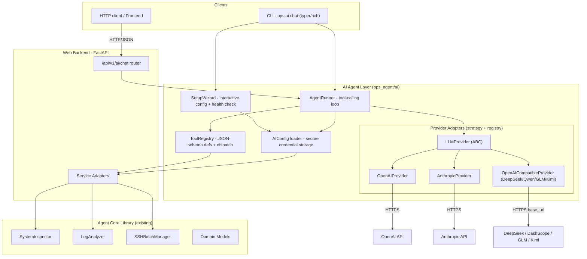
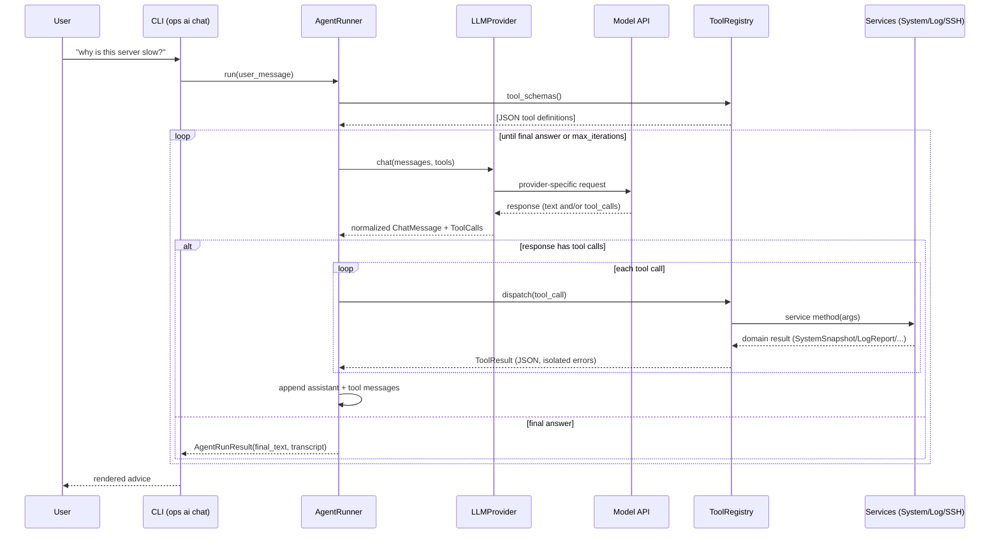
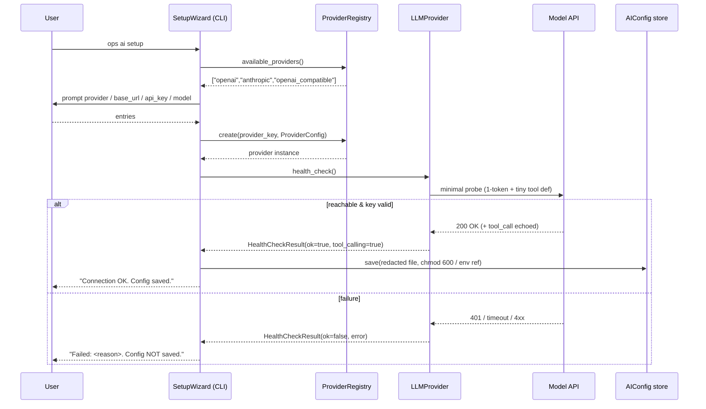

# Design Document: AI Agent Layer

## Overview

The AI Agent Layer upgrades `cli-ops-agent` from a mechanical executor into a natural-language-driven operations assistant. Instead of the user manually choosing `inspect system`, `analyze logs`, or `ssh run`, they describe a problem in plain language ("why is this server slow?"). An LLM autonomously decides which existing capabilities to invoke, reads the structured results, reasons over them across multiple turns, and returns operational advice.

This is implemented as an **agentic tool-calling loop**: the agent sends the conversation plus a set of JSON-schema tool definitions to a model; the model responds with zero or more tool calls; the orchestrator executes those tools against the **existing service layer** (`SystemService`, `LogService`, `SSHService`), feeds the results back into the conversation, and repeats until the model produces a final answer or a safety bound is reached. No ops business logic is duplicated — the AI layer is a new consumer of the same services the CLI and web backend already use.

The design emphasizes **multi-provider extensibility**. A provider abstraction (strategy pattern + registry) supports OpenAI, Anthropic, and OpenAI-compatible endpoints (covering Chinese mainstream models such as DeepSeek, Alibaba Qwen/DashScope, Zhipu GLM, and Moonshot Kimi via a custom `base_url`). Adding a new provider means registering one adapter class. The design also covers an **interactive setup wizard** that prompts for provider/base_url/api_key/model at install time, runs a **connectivity + tool-calling health check**, and persists credentials securely (restricted-permission file plus the existing `${ENV}` substitution pattern). This document provides both a high-level view (architecture, sequence diagrams, components, data models) and a low-level view (file structure, class/function signatures, algorithmic pseudocode with pre/postconditions) so it can be handed directly to a coding agent.

## Architecture



**Key architectural decisions:**

- **Reuse, don't duplicate.** The `ToolRegistry` dispatches tool calls to the existing `SystemService` / `LogService` / `SSHService`. The AI layer adds orchestration and reasoning, not ops logic.
- **Provider strategy + registry.** Every provider implements one ABC (`LLMProvider`). A `ProviderRegistry` maps a provider key (e.g. `"openai"`, `"anthropic"`, `"openai_compatible"`) to its adapter class, so new providers are added by registration only.
- **Normalized message/tool protocol.** Internally the loop works on provider-agnostic `ChatMessage` / `ToolCall` / `ToolResult` models. Each adapter translates to/from its vendor wire format. This isolates schema differences (OpenAI `tool_calls`, Anthropic `tool_use` content blocks, OpenAI-compatible variants).
- **Secure-by-default credentials.** API keys are never hardcoded. They are read from an env var or a restricted-permission config file, support `${ENV}` substitution, and are redacted in all logs and serialization.
- **Safety bound on autonomy.** The loop has a `max_iterations` cap and per-tool error isolation, guaranteeing termination and preventing a single tool failure from aborting the run.
- **SSH guardrails.** Because the SSH tool lets the LLM trigger arbitrary remote commands, it is gated behind an allowlist/confirmation policy (see Security Considerations).

## Sequence Diagrams

### Flow 1: Natural-language request through the tool-calling loop



### Flow 2: Install-time setup wizard + connectivity / tool-calling health check



## Project File Structure

New files are added under a single new package `ops_agent/ai/`, mirroring the existing layout (core / services / web / cli separation). Existing files are extended minimally (new CLI sub-app registration, new router registration).

```text
ops_agent/
├── ai/                              # NEW: AI Agent Layer
│   ├── __init__.py
│   ├── models.py                    # Pydantic: provider/model config, messages, tools, results
│   ├── config.py                    # AIConfig load/save, secure credential storage + ${ENV}
│   ├── agent.py                     # AgentRunner: the tool-calling loop
│   ├── tool_registry.py             # ToolRegistry: JSON-schema defs + dispatch to services
│   ├── tools.py                     # Tool wrappers around System/Log/SSH services
│   ├── setup_wizard.py              # Interactive setup + connectivity/health check
│   ├── errors.py                    # AI-layer exception hierarchy
│   └── providers/
│       ├── __init__.py
│       ├── base.py                  # LLMProvider ABC
│       ├── registry.py              # ProviderRegistry (strategy registry)
│       ├── openai_provider.py       # OpenAIProvider (official OpenAI API)
│       ├── anthropic_provider.py    # AnthropicProvider (Claude API)
│       └── openai_compatible.py     # OpenAICompatibleProvider (DeepSeek/Qwen/GLM/Kimi)
├── cli/
│   ├── app.py                       # EXTENDED: register `ai` sub-app
│   └── commands_ai.py               # NEW: `ai chat`, `ai setup`, `ai ask`
├── services/                        # UNCHANGED (reused via tools)
└── web/
    ├── server.py                    # EXTENDED: include ai router
    ├── schemas.py                   # EXTENDED: AiChatRequest
    └── routers/
        └── ai.py                    # NEW: POST /api/v1/ai/chat

config/
└── ai.example.yaml                  # NEW: sample AI config with ${ENV} api_key

tests/
├── test_ai_providers.py            # NEW: registry round-trip, normalization
├── test_ai_agent_loop.py           # NEW: loop termination, max-iteration bound
├── test_ai_tool_registry.py        # NEW: dispatch correctness
└── test_ai_config.py               # NEW: credential redaction, env substitution
```

## Components and Interfaces

This section summarizes the public contracts. Per-module file/class/function breakdowns and formal specifications appear below.

### Component: LLMProvider (ABC)
**Purpose:** Vendor-agnostic interface for chat + tool calling and health checks.
```python
class LLMProvider(ABC):
    def __init__(self, config: ProviderConfig) -> None: ...
    @abstractmethod
    def chat(self, messages: list[ChatMessage], tools: list[ToolDefinition]) -> ChatMessage: ...
    @abstractmethod
    def health_check(self) -> HealthCheckResult: ...
    @property
    @abstractmethod
    def supports_tool_calling(self) -> bool: ...
```
**Responsibilities:** translate normalized messages/tools to/from the vendor wire format; surface a uniform `ChatMessage` (with optional `tool_calls`); never leak the API key.

### Component: ProviderRegistry
**Purpose:** Map provider keys to adapter classes (strategy registry).
```python
class ProviderRegistry:
    @classmethod
    def register(cls, key: str, provider_cls: type[LLMProvider]) -> None: ...
    @classmethod
    def create(cls, config: ProviderConfig) -> LLMProvider: ...
    @classmethod
    def available(cls) -> list[str]: ...
```

### Component: ToolRegistry
**Purpose:** Expose JSON-schema tool definitions to the model and dispatch tool calls to services.
```python
class ToolRegistry:
    def register(self, tool: Tool) -> None: ...
    def schemas(self) -> list[ToolDefinition]: ...
    def dispatch(self, call: ToolCall) -> ToolResult: ...
```

### Component: AgentRunner
**Purpose:** Drive the iterative tool-calling loop with a max-iteration safety bound.
```python
class AgentRunner:
    def __init__(self, provider: LLMProvider, registry: ToolRegistry,
                 max_iterations: int = 8, system_prompt: str | None = None) -> None: ...
    def run(self, user_message: str, history: list[ChatMessage] | None = None) -> AgentRunResult: ...
```

### Component: SetupWizard
**Purpose:** Interactively gather provider config, run health check, persist securely.
```python
class SetupWizard:
    def run(self) -> AIConfig: ...
    def probe(self, provider: LLMProvider) -> HealthCheckResult: ...
```

### Component: AI CLI + Web
**Purpose:** Expose the agent through both surfaces, reusing services.
```python
def ai_chat(message: str, config: str | None, json_out: bool) -> None: ...   # CLI
@router.post("/ai/chat", response_model=AgentRunResult)
def ai_chat_endpoint(req: AiChatRequest) -> AgentRunResult: ...               # Web
```

## Data Models

All models are Pydantic v2 `BaseModel` subclasses in `ops_agent/ai/models.py`, consistent with `ops_agent/core/models.py`. Secret fields use `pydantic.SecretStr` so they are redacted by default in `repr`/`model_dump`.

```python
from __future__ import annotations

from enum import Enum
from typing import Any, Literal

from pydantic import BaseModel, Field, SecretStr, field_validator


class ProviderKind(str, Enum):
    OPENAI = "openai"
    ANTHROPIC = "anthropic"
    OPENAI_COMPATIBLE = "openai_compatible"   # DeepSeek, Qwen/DashScope, GLM, Kimi, ...


class ProviderConfig(BaseModel):
    kind: ProviderKind
    base_url: str | None = None               # required for openai_compatible; optional override otherwise
    api_key: SecretStr                         # redacted in logs/serialization
    model: str                                 # e.g. "gpt-4o", "claude-3-5-sonnet", "deepseek-chat"
    timeout_s: int = Field(default=30, ge=1)
    max_tokens: int = Field(default=1024, ge=1)
    temperature: float = Field(default=0.2, ge=0.0, le=2.0)
    extra_headers: dict[str, str] = Field(default_factory=dict)

    @field_validator("base_url")
    @classmethod
    def compat_requires_base_url(cls, v: str | None, info) -> str | None:
        # openai_compatible providers MUST supply a base_url
        return v


class AIConfig(BaseModel):
    provider: ProviderConfig
    max_iterations: int = Field(default=8, ge=1, le=50)
    system_prompt: str | None = None
    ssh_tool_enabled: bool = False             # SSH tool off by default (safety)
    ssh_command_allowlist: list[str] = Field(default_factory=list)


class Role(str, Enum):
    SYSTEM = "system"
    USER = "user"
    ASSISTANT = "assistant"
    TOOL = "tool"


class ToolCall(BaseModel):
    id: str                                    # provider-issued call id (for correlation)
    name: str                                  # tool name, must exist in ToolRegistry
    arguments: dict[str, Any]                  # parsed JSON arguments


class ChatMessage(BaseModel):
    role: Role
    content: str | None = None
    tool_calls: list[ToolCall] = Field(default_factory=list)   # only on assistant messages
    tool_call_id: str | None = None            # set on tool-result messages, correlates to ToolCall.id
    name: str | None = None                    # tool name on tool-result messages


class ToolDefinition(BaseModel):
    name: str
    description: str
    parameters: dict[str, Any]                 # JSON Schema object


class ToolResult(BaseModel):
    tool_call_id: str
    name: str
    ok: bool
    content: str                               # JSON-serialized result or error message
    error: str | None = None


class HealthCheckResult(BaseModel):
    ok: bool
    provider: ProviderKind
    model: str
    tool_calling: bool = False                 # whether the probe confirmed tool-calling support
    latency_ms: int = 0
    error: str | None = None


class AgentRunResult(BaseModel):
    final_text: str
    iterations: int
    transcript: list[ChatMessage]
    tool_invocations: list[ToolResult]
    stopped_reason: Literal["final_answer", "max_iterations", "error"]
```

**Validation rules:**

- `api_key` is a `SecretStr`; `model_dump()` yields `"**********"` and never the raw key unless `SecretStr.get_secret_value()` is explicitly called by the adapter at request time.
- `ProviderConfig.base_url` MUST be set when `kind == OPENAI_COMPATIBLE` (enforced in `AIConfig` loader, see Config module).
- `max_iterations` is bounded `[1, 50]` to guarantee termination.
- `ssh_tool_enabled` defaults to `False`; the SSH tool is only registered when explicitly enabled.
- A `tool` role `ChatMessage` MUST carry a `tool_call_id` matching a prior assistant `ToolCall.id`.

---

## Module: AI / Providers (Abstraction + Adapters)

**Description:** The provider abstraction layer. Defines the `LLMProvider` ABC, a `ProviderRegistry` implementing the strategy pattern, and three concrete adapters. Each adapter owns the translation between the normalized `ChatMessage`/`ToolDefinition`/`ToolCall` models and its vendor wire format, including the differences in base_url, auth header style, request/response schema, and tool-calling expression.

**Files:**
- `ops_agent/ai/providers/base.py`: `LLMProvider` ABC.
- `ops_agent/ai/providers/registry.py`: `ProviderRegistry`.
- `ops_agent/ai/providers/openai_provider.py`: `OpenAIProvider`.
- `ops_agent/ai/providers/anthropic_provider.py`: `AnthropicProvider`.
- `ops_agent/ai/providers/openai_compatible.py`: `OpenAICompatibleProvider`.

**Classes:**
- `LLMProvider` (ABC): uniform chat/health/capability contract.
- `ProviderRegistry`: key → adapter class map with `register` / `create` / `available`.
- `OpenAIProvider`: uses the `openai` SDK; tool calls via `tool_calls` array.
- `AnthropicProvider`: uses the `anthropic` SDK; tool calls via `tool_use` content blocks; `x-api-key` header.
- `OpenAICompatibleProvider`: reuses the `openai` SDK with a custom `base_url` (DeepSeek, Qwen/DashScope, GLM, Kimi).

**Functions / Methods:**
- `LLMProvider.chat(messages, tools) -> ChatMessage`
- `LLMProvider.health_check() -> HealthCheckResult`
- `LLMProvider.supports_tool_calling -> bool`
- `ProviderRegistry.register(key, provider_cls) -> None`
- `ProviderRegistry.create(config) -> LLMProvider`
- `ProviderRegistry.available() -> list[str]`
- `OpenAIProvider._to_wire(messages, tools)` / `_from_wire(response) -> ChatMessage`
- `AnthropicProvider._to_wire(...)` / `_from_wire(...)`: maps `tool_use`/`tool_result` content blocks.

**Dependencies:** `openai` (also used by `OpenAICompatibleProvider`), `anthropic`, `httpx` (transport / fallback for raw compatible endpoints), `pydantic`.

### Key Functions with Formal Specifications

```python
from abc import ABC, abstractmethod


class LLMProvider(ABC):
    def __init__(self, config: ProviderConfig) -> None: ...

    @abstractmethod
    def chat(self, messages: list[ChatMessage], tools: list[ToolDefinition]) -> ChatMessage:
        """Send a single chat turn and return the assistant's normalized reply."""

    @abstractmethod
    def health_check(self) -> HealthCheckResult:
        """Perform a minimal probe verifying url + key (and tool-calling if possible)."""

    @property
    @abstractmethod
    def supports_tool_calling(self) -> bool: ...


class ProviderRegistry:
    _registry: dict[str, type[LLMProvider]] = {}

    @classmethod
    def register(cls, key: str, provider_cls: type[LLMProvider]) -> None: ...

    @classmethod
    def create(cls, config: ProviderConfig) -> LLMProvider: ...

    @classmethod
    def available(cls) -> list[str]: ...
```

**`ProviderRegistry.create(config)`**
- Preconditions: `config.kind.value` (or a registered alias) exists in `_registry`; `config` is a valid `ProviderConfig`.
- Postconditions: returns an `LLMProvider` instance whose `config` equals the input; raises `UnknownProviderError` if the key is not registered.
- Side effects: none (instantiation only; no network).

**`LLMProvider.chat(messages, tools)`**
- Preconditions: `messages` is non-empty and well-ordered (system?, then user/assistant/tool turns); every `tool` message references a prior assistant `ToolCall.id`.
- Postconditions: returns one assistant `ChatMessage`; if the model requested tools, `result.tool_calls` is non-empty and each `arguments` is valid parsed JSON; the raw API key never appears in the returned object or any raised error.
- Side effects: one outbound HTTPS request.

**`LLMProvider.health_check()`**
- Preconditions: `config` is populated.
- Postconditions: returns a definite `HealthCheckResult` with `ok in {True, False}` (never raises for expected network/auth failures — those are captured in `error`); `latency_ms >= 0`.

### Algorithmic Pseudocode: Provider response normalization

```pascal
ALGORITHM openai_from_wire(response)
OUTPUT: msg of type ChatMessage
BEGIN
  choice ← response.choices[0]
  raw_calls ← choice.message.tool_calls OR empty

  calls ← empty list
  FOR each rc IN raw_calls DO
    args ← json_parse(rc.function.arguments)   // tolerate empty string -> {}
    calls.add(ToolCall(id := rc.id, name := rc.function.name, arguments := args))
  END FOR

  RETURN ChatMessage(
    role := ASSISTANT,
    content := choice.message.content,
    tool_calls := calls
  )
END

ALGORITHM anthropic_from_wire(response)
OUTPUT: msg of type ChatMessage
BEGIN
  text_parts ← empty list
  calls ← empty list

  FOR each block IN response.content DO
    IF block.type = "text" THEN
      text_parts.add(block.text)
    ELSE IF block.type = "tool_use" THEN
      calls.add(ToolCall(id := block.id, name := block.name, arguments := block.input))
    END IF
  END FOR

  RETURN ChatMessage(
    role := ASSISTANT,
    content := join(text_parts, "\n") IF text_parts ELSE NULL,
    tool_calls := calls
  )
END
```

### Example Usage

```python
from ops_agent.ai.providers.registry import ProviderRegistry
from ops_agent.ai.models import ProviderConfig, ProviderKind

# Official OpenAI
cfg = ProviderConfig(kind=ProviderKind.OPENAI, api_key="${OPENAI_API_KEY}", model="gpt-4o")
provider = ProviderRegistry.create(cfg)

# Chinese model via OpenAI-compatible endpoint (DeepSeek)
deepseek = ProviderConfig(
    kind=ProviderKind.OPENAI_COMPATIBLE,
    base_url="https://api.deepseek.com/v1",
    api_key="${DEEPSEEK_API_KEY}",
    model="deepseek-chat",
)
provider2 = ProviderRegistry.create(deepseek)
```

> **Provider differences captured by the adapters:**
> | Concern | OpenAI | Anthropic | OpenAI-compatible (CN) |
> |---|---|---|---|
> | Auth header | `Authorization: Bearer` | `x-api-key` + `anthropic-version` | `Authorization: Bearer` |
> | base_url | default (overridable) | default (overridable) | **required** custom |
> | Tool calls in response | `tool_calls[]` | `tool_use` content blocks | `tool_calls[]` (mostly) |
> | Tool result back to model | `role:"tool"` message | `tool_result` content block | `role:"tool"` message |
> | SDK | `openai` | `anthropic` | `openai` (custom base_url) |

---

## Module: AI / Tool Registry + Tools

**Description:** Wraps the existing ops services as model-callable tools. The `ToolRegistry` produces JSON-schema `ToolDefinition`s for the model and dispatches incoming `ToolCall`s to the right service, isolating execution errors into `ToolResult`s. No ops logic lives here — each tool is a thin adapter over `SystemService` / `LogService` / `SSHService`.

**Files:**
- `ops_agent/ai/tool_registry.py`: `ToolRegistry`, `Tool` protocol.
- `ops_agent/ai/tools.py`: concrete tool wrappers + `build_default_registry(...)`.

**Classes:**
- `Tool` (protocol/dataclass): `name`, `description`, `parameters` (JSON Schema), `handler(args) -> BaseModel | dict`.
- `ToolRegistry`: holds tools, emits schemas, dispatches calls.

**Functions / Methods:**
- `ToolRegistry.register(tool) -> None`
- `ToolRegistry.schemas() -> list[ToolDefinition]`
- `ToolRegistry.dispatch(call: ToolCall) -> ToolResult`
- `build_default_registry(config: AIConfig, app_config: AppConfig) -> ToolRegistry`: registers `inspect_system`, `analyze_logs`, and (only if enabled) `ssh_run`.

**Default tools exposed to the model:**
- `inspect_system()` → `SystemService.snapshot()` → `SystemSnapshot`
- `analyze_logs(path, patterns?, levels?, since?, max_matches?)` → `LogService.analyze(...)` → `LogReport`
- `ssh_run(command, host_names)` → `SSHService.run_batch(...)` → `list[CommandResult]` (allowlist/confirmation gated)

**Dependencies:** `pydantic`, plus the existing `services` package.

### Key Functions with Formal Specifications

```python
class ToolRegistry:
    def __init__(self) -> None: ...
    def register(self, tool: Tool) -> None: ...
    def schemas(self) -> list[ToolDefinition]: ...
    def dispatch(self, call: ToolCall) -> ToolResult: ...
```

**`dispatch(call)`**
- Preconditions: `call.name` and `call.arguments` are provided.
- Postconditions: if `call.name` is unknown → `ToolResult(ok=False, error="unknown tool ...")` (never raises); if the handler raises → `ToolResult(ok=False, error=str(e))` (failure isolation); on success → `ToolResult(ok=True, content=json(result))`; `result.tool_call_id == call.id` and `result.name == call.name` always.
- Side effects: those of the underlying service (e.g. `ssh_run` executes remote commands).

**`schemas()`**
- Postconditions: returns one `ToolDefinition` per registered tool; names are unique; each `parameters` is a valid JSON Schema object.

### Algorithmic Pseudocode

```pascal
ALGORITHM dispatch(call)
OUTPUT: result of type ToolResult
BEGIN
  tool ← _tools.get(call.name)
  IF tool = NULL THEN
    RETURN ToolResult(call.id, call.name, ok := false,
                      content := "", error := "unknown tool: " + call.name)
  END IF

  TRY
    validated ← validate_args(call.arguments, tool.parameters)   // raises on bad schema
    output ← tool.handler(validated)                              // calls a service
    payload ← json_serialize(output)                             // pydantic model_dump_json
    RETURN ToolResult(call.id, call.name, ok := true, content := payload, error := NULL)
  CATCH ValidationError OR ServiceError AS e
    RETURN ToolResult(call.id, call.name, ok := false,
                      content := "", error := str(e))            // isolated, loop continues
  END TRY
END
```

### Example tool definition (JSON Schema emitted to the model)

```python
ToolDefinition(
    name="analyze_logs",
    description="Scan a log file for patterns/levels and return counts, matches, and a summary.",
    parameters={
        "type": "object",
        "properties": {
            "path": {"type": "string", "description": "Path to the log file"},
            "patterns": {"type": "array", "items": {"type": "string"}},
            "levels": {"type": "array", "items": {"type": "string"}},
            "since": {"type": "string", "format": "date-time"},
            "max_matches": {"type": "integer", "minimum": 0, "default": 1000},
        },
        "required": ["path"],
    },
)
```

---

## Module: AI / Agent (Tool-Calling Loop)

**Description:** The orchestration core. `AgentRunner` runs the iterative loop: build the message list (system prompt + history + user message), call the provider with tool schemas, execute any requested tools via the registry, append results, and repeat until the model returns a final text answer or `max_iterations` is hit. Guarantees termination and isolates tool failures.

**Files:**
- `ops_agent/ai/agent.py`: `AgentRunner`.

**Classes:**
- `AgentRunner`: holds a provider, a tool registry, and loop configuration.

**Functions / Methods:**
- `AgentRunner.run(user_message, history=None) -> AgentRunResult`
- `AgentRunner._initial_messages(user_message, history) -> list[ChatMessage]`
- `AgentRunner._execute_tool_calls(calls) -> list[ChatMessage]`: dispatch + wrap as `tool` role messages.

**Dependencies:** `pydantic`, the providers module, the tool registry module.

### Key Functions with Formal Specifications

```python
class AgentRunner:
    def __init__(self, provider: LLMProvider, registry: ToolRegistry,
                 max_iterations: int = 8, system_prompt: str | None = None) -> None: ...

    def run(self, user_message: str, history: list[ChatMessage] | None = None) -> AgentRunResult: ...
```

**`run(user_message, history)`**
- Preconditions: `user_message` is non-empty; `max_iterations >= 1`; `provider.supports_tool_calling` is `True` (else fail fast with a clear error before the loop).
- Postconditions: terminates in at most `max_iterations` provider calls; returns an `AgentRunResult` whose `iterations <= max_iterations`; `stopped_reason` is `"final_answer"` if the model produced text with no tool calls, `"max_iterations"` if the bound was reached, or `"error"` on provider failure; `transcript` is a consistent, replayable message sequence; the raw API key never appears in `transcript` or `final_text`.
- Loop invariant: at the start of each iteration, every `tool` message in the working list correlates to a `ToolCall.id` emitted by an earlier assistant message.
- Side effects: provider HTTPS calls + side effects of any executed tools.

### Algorithmic Pseudocode: The agent tool-calling loop

```pascal
ALGORITHM run(user_message, history)
INPUT: user_message (non-empty), history (optional)
OUTPUT: result of type AgentRunResult
BEGIN
  ASSERT user_message ≠ ""
  ASSERT max_iterations >= 1

  IF NOT provider.supports_tool_calling THEN
    RETURN AgentRunResult(final_text := "Selected model does not support tool calling.",
                          iterations := 0, transcript := [], tool_invocations := [],
                          stopped_reason := "error")
  END IF

  messages   ← _initial_messages(user_message, history)   // [system?, ...history, user]
  tools      ← registry.schemas()
  invocations ← empty list
  iter       ← 0

  WHILE iter < max_iterations DO
    INVARIANT: every tool-role message in `messages` correlates to a prior assistant ToolCall.id
    iter ← iter + 1

    TRY
      reply ← provider.chat(messages, tools)              // one HTTPS turn
    CATCH ProviderError AS e
      RETURN AgentRunResult(final_text := "Provider error: " + str(e),
                            iterations := iter, transcript := messages,
                            tool_invocations := invocations, stopped_reason := "error")
    END TRY

    messages.add(reply)                                    // assistant turn

    IF reply.tool_calls IS EMPTY THEN
      RETURN AgentRunResult(final_text := reply.content OR "",
                            iterations := iter, transcript := messages,
                            tool_invocations := invocations, stopped_reason := "final_answer")
    END IF

    // Execute every requested tool; failures are isolated into ToolResults
    FOR each call IN reply.tool_calls DO
      tr ← registry.dispatch(call)
      invocations.add(tr)
      messages.add(ChatMessage(role := TOOL, tool_call_id := tr.tool_call_id,
                               name := tr.name,
                               content := tr.content IF tr.ok ELSE ("ERROR: " + tr.error)))
    END FOR
  END WHILE

  // Bound reached without a final answer
  RETURN AgentRunResult(final_text := "Reached max iterations without a final answer.",
                        iterations := iter, transcript := messages,
                        tool_invocations := invocations, stopped_reason := "max_iterations")
END
```

### Example Usage

```python
from ops_agent.ai.agent import AgentRunner
from ops_agent.ai.providers.registry import ProviderRegistry
from ops_agent.ai.tools import build_default_registry
from ops_agent.ai.config import load_ai_config
from ops_agent.core.config import load_config

ai_cfg = load_ai_config("config/ai.yaml")
app_cfg = load_config("config/hosts.yaml")

provider = ProviderRegistry.create(ai_cfg.provider)
registry = build_default_registry(ai_cfg, app_cfg)
runner = AgentRunner(provider, registry,
                     max_iterations=ai_cfg.max_iterations,
                     system_prompt=ai_cfg.system_prompt)

result = runner.run("Why is this server slow? Check CPU/memory and recent errors.")
print(result.final_text)
print(f"({result.iterations} iterations, stopped: {result.stopped_reason})")
```

---

## Module: AI / Setup Wizard + Connectivity Health Check

**Description:** Interactive install-time flow (Typer + Rich prompts) that collects provider/base_url/api_key/model, constructs the provider, runs a lightweight connectivity + tool-calling probe, reports success/failure clearly, and only on success persists the config securely.

**Files:**
- `ops_agent/ai/setup_wizard.py`: `SetupWizard`.

**Classes:**
- `SetupWizard`: orchestrates prompts → probe → save.

**Functions / Methods:**
- `SetupWizard.run() -> AIConfig`: full interactive flow.
- `SetupWizard.probe(provider) -> HealthCheckResult`: delegates to `provider.health_check()` and formats output.
- `SetupWizard._prompt_provider() -> ProviderKind`, `_prompt_credentials(kind) -> ProviderConfig`.

**Dependencies:** `typer`, `rich`, the providers module, the config module.

### Key Functions with Formal Specifications

**`run()`**
- Preconditions: runs in an interactive TTY (falls back to error if non-interactive without env vars).
- Postconditions: returns a validated `AIConfig` only if the health check passed and the user confirmed save; on failure, raises/exits without writing config; the api_key entry is masked at input and never echoed.

**`health_check()` (provider-side, used by probe)**
- Postconditions: returns a definite `HealthCheckResult`; sets `tool_calling=True` only if the probe sent a trivial tool definition and the model echoed a well-formed tool call (best-effort; `False` does not necessarily mean unsupported).

### Algorithmic Pseudocode: Connectivity / health check

```pascal
ALGORITHM health_check()      // implemented per provider
OUTPUT: result of type HealthCheckResult
BEGIN
  start ← now_ms()
  probe_tool ← ToolDefinition(
    name := "ping",
    description := "Return pong. Used only to verify tool calling.",
    parameters := {"type":"object","properties":{},"required":[]}
  )
  messages ← [ ChatMessage(role := USER,
                content := "Reply with the word OK. If you can call tools, call ping.") ]

  TRY
    reply ← chat(messages, [probe_tool])     // bounded by config.timeout_s, max_tokens small
  CATCH AuthError AS e
    RETURN HealthCheckResult(ok := false, provider := kind, model := config.model,
                             tool_calling := false, latency_ms := now_ms()-start,
                             error := "Authentication failed (check API key)")
  CATCH ConnectError OR TimeoutError AS e
    RETURN HealthCheckResult(ok := false, provider := kind, model := config.model,
                             tool_calling := false, latency_ms := now_ms()-start,
                             error := "Cannot reach endpoint: " + str(e))
  CATCH ProviderError AS e
    RETURN HealthCheckResult(ok := false, provider := kind, model := config.model,
                             tool_calling := false, latency_ms := now_ms()-start,
                             error := str(e))
  END TRY

  tool_ok ← (reply.tool_calls is non-empty AND reply.tool_calls[0].name = "ping")
  RETURN HealthCheckResult(ok := true, provider := kind, model := config.model,
                           tool_calling := tool_ok, latency_ms := now_ms()-start, error := NULL)
END
```

### Example interactive session

```text
$ ops ai setup
? Select provider:  (openai / anthropic / openai_compatible)  > openai_compatible
? Base URL:  > https://api.deepseek.com/v1
? Model name:  > deepseek-chat
? API key:  > ************************   (input hidden)
Running connectivity check... 
  ✓ Endpoint reachable (latency 412 ms)
  ✓ Authentication OK
  ✓ Tool calling supported
Save configuration to config/ai.yaml? [Y/n] > Y
Saved. API key written as env reference ${DEEPSEEK_API_KEY} (set this in your environment).
```

---

## Module: AI / Config (Secure Credential Storage)

**Description:** Loads and saves `AIConfig` from YAML, applying the existing `${ENV}` substitution and enforcing secure handling of the api_key. On save, the wizard prefers writing an env reference (`${PROVIDER_API_KEY}`) rather than the raw secret; if a raw key must be written, the file is created with owner-only permissions (chmod 600 on POSIX).

**Files:**
- `ops_agent/ai/config.py`: `load_ai_config`, `save_ai_config`, `redact`.
- `config/ai.example.yaml`: sample.

**Classes:** uses `AIConfig` / `ProviderConfig` from `ai/models.py`.

**Functions / Methods:**
- `load_ai_config(path: str | None = None) -> AIConfig`: read YAML, apply `${ENV}` substitution (reuse `core.config._substitute_env`), validate; enforce base_url-required-for-compatible.
- `save_ai_config(config: AIConfig, path: str, store_key_as_env: bool = True) -> None`: write YAML; if `store_key_as_env`, persist `${...}` placeholder; else write raw key and set file mode `0o600`.
- `redact(config: AIConfig) -> dict`: return a dict safe for logging (api_key → `"********"`).

**Dependencies:** `pydantic`, `pyyaml`, reuse of `ops_agent.core.config`.

### Key Functions with Formal Specifications

**`load_ai_config(path)`**
- Preconditions: if `path` is given, the file exists and is valid YAML.
- Postconditions: returns a validated `AIConfig`; any `${ENV}` tokens are resolved from the environment; if `provider.kind == OPENAI_COMPATIBLE` and `base_url` is missing/empty → raises `ConfigError`.

**`save_ai_config(config, path, store_key_as_env)`**
- Postconditions: file at `path` exists; if `store_key_as_env` then the serialized `api_key` is an env placeholder and the raw secret is absent from disk; otherwise on POSIX the file mode is `0o600`. In no case is the raw key printed to stdout/logs.

### Example `config/ai.example.yaml`

```yaml
provider:
  kind: openai_compatible
  base_url: https://api.deepseek.com/v1
  api_key: ${DEEPSEEK_API_KEY}      # env-substituted at load; never commit raw keys
  model: deepseek-chat
  timeout_s: 30
  max_tokens: 1024
  temperature: 0.2
max_iterations: 8
ssh_tool_enabled: false             # enable only with an allowlist (see security notes)
ssh_command_allowlist:
  - "uptime"
  - "df -h"
  - "free -m"
system_prompt: >
  You are an operations assistant. Use the provided tools to inspect the system
  and logs before answering. Be concise and cite the metrics you observed.
```

---

## Module: AI CLI Command

**Description:** New Typer sub-app `ai` registered on the existing CLI. Provides `ai setup` (wizard), `ai chat` / `ai ask` (run the agent on a natural-language message). Renders the final answer and an optional transcript with Rich; `--json` emits the `AgentRunResult`. No business logic — delegates to `AgentRunner`.

**Files:**
- `ops_agent/cli/commands_ai.py`: command implementations.
- `ops_agent/cli/app.py`: EXTENDED to add `app.add_typer(ai_app, name="ai")`.

**Functions:**
- `ai_setup(config_path: str | None) -> None`: run `SetupWizard`.
- `ai_chat(message: str, config: str | None, hosts_config: str | None, show_transcript: bool, json_out: bool) -> None`.
- `render_run_result(result: AgentRunResult, show_transcript: bool, json_out: bool) -> None`.

**Dependencies:** `typer`, `rich`, the `ai` package.

### Example Usage

```bash
# One-time interactive setup with connectivity check
ops ai setup

# Ask a question; the agent decides which tools to call
ops ai chat "why is this server slow?"

# Show the full tool-calling transcript, or emit JSON
ops ai chat "any errors in /var/log/syslog in the last hour?" --show-transcript
ops ai ask "check disk usage and uptime on web1,web2" --json
```

```python
# ops_agent/cli/app.py (extension)
from ops_agent.cli.commands_ai import ai_setup, ai_chat

ai_app = typer.Typer(help="Natural-language AI operations agent")
app.add_typer(ai_app, name="ai")

@ai_app.command("setup")
def _ai_setup(config: str | None = typer.Option(None, "--config", "-c")) -> None:
    """Interactively configure the LLM provider and run a connectivity check."""
    ai_setup(config)

@ai_app.command("chat")
def _ai_chat(
    message: str = typer.Argument(..., help="Natural-language request"),
    config: str | None = typer.Option(None, "--config", "-c", help="AI config YAML"),
    hosts_config: str | None = typer.Option(None, "--hosts-config", help="Hosts YAML"),
    show_transcript: bool = typer.Option(False, "--show-transcript"),
    json_out: bool = typer.Option(False, "--json"),
) -> None:
    """Send a natural-language request to the AI agent."""
    ai_chat(message, config, hosts_config, show_transcript, json_out)
```

---

## Module: AI Web Endpoint (FastAPI)

**Description:** New router exposing the agent over REST, reusing the same `AgentRunner` and services. Stateless; the request may include prior history for multi-turn use. Returns the `AgentRunResult` directly as the response model.

**Files:**
- `ops_agent/web/routers/ai.py`: `POST /api/v1/ai/chat`.
- `ops_agent/web/schemas.py`: EXTENDED with `AiChatRequest`.
- `ops_agent/web/deps.py`: EXTENDED with `get_agent_runner()`.
- `ops_agent/web/server.py`: EXTENDED to `include_router(ai.router, prefix="/api/v1")`.

**Classes (request schema):**
- `AiChatRequest`: `{ message: str, history: list[ChatMessage] = [] }`.

**Functions / Endpoints:**
- `ai_chat_endpoint(req: AiChatRequest, runner: AgentRunner = Depends(get_agent_runner)) -> AgentRunResult` (POST `/api/v1/ai/chat`).
- `get_agent_runner() -> AgentRunner`: builds provider + registry from loaded `AIConfig` (cached).

**Dependencies:** `fastapi`, `pydantic`, the `ai` package, the `services` package.

### API Surface

| Method | Path                 | Request          | Response         |
|--------|----------------------|------------------|------------------|
| POST   | `/api/v1/ai/chat`    | `AiChatRequest`  | `AgentRunResult` |

### Example Usage

```python
# ops_agent/web/routers/ai.py
from fastapi import APIRouter, Depends
from ops_agent.ai.agent import AgentRunner
from ops_agent.ai.models import AgentRunResult
from ops_agent.web.schemas import AiChatRequest
from ops_agent.web.deps import get_agent_runner

router = APIRouter(tags=["ai"])

@router.post("/ai/chat", response_model=AgentRunResult)
def ai_chat_endpoint(
    req: AiChatRequest,
    runner: AgentRunner = Depends(get_agent_runner),
) -> AgentRunResult:
    return runner.run(req.message, history=req.history)
```

> **Security note:** This endpoint lets a remote caller drive an LLM that can call ops tools (including SSH if enabled). It MUST be protected by authentication and MUST NOT be exposed publicly with `ssh_tool_enabled=True` and a permissive allowlist. See Security Considerations.

---

## Correctness Properties

For all valid inputs, the following must hold (suitable for property-based tests with `hypothesis`).

### Property 1: Provider registry round-trip
For any registered key `k` and a valid `ProviderConfig c` with `c.kind` mapping to `k`, `ProviderRegistry.create(c)` returns an instance `p` such that `type(p)` is the class registered under `k` and `p.config == c`. For any unregistered key, `create` raises `UnknownProviderError`.

### Property 2: Agent loop termination / max-iteration bound
For any `user_message` and any provider behavior, `AgentRunner.run(...)` terminates with `result.iterations <= max_iterations`. If the model always returns tool calls, `stopped_reason == "max_iterations"`; if it ever returns no tool calls, `stopped_reason == "final_answer"`.

### Property 3: Tool dispatch maps name → correct service
For any registered tool name `n`, `ToolRegistry.dispatch(ToolCall(name=n, ...))` invokes exactly the handler registered under `n`, and the resulting `ToolResult` satisfies `result.name == n` and `result.tool_call_id == call.id`.

### Property 4: Tool failure isolation
For any `ToolCall` whose handler raises, or whose name is unknown, `dispatch` returns `ToolResult(ok=False, error != None)` and never raises. The agent loop continues and still terminates.

### Property 5: Connectivity check is definite
For any provider and any (possibly failing) endpoint behavior, `health_check()` returns a `HealthCheckResult` with `ok in {True, False}` and `latency_ms >= 0`; it never raises for expected auth/network errors.

### Property 6: Credential redaction never leaks keys
For any `ProviderConfig`/`AIConfig` containing an api_key, `model_dump()`, `model_dump_json()`, `repr()`, `redact(...)`, and any `AgentRunResult.transcript`/`final_text` produced by a run do NOT contain the raw secret string.

### Property 7: Transcript correlation invariant
For any completed `AgentRunResult`, every `ChatMessage` with `role == TOOL` has a `tool_call_id` equal to the `id` of some `ToolCall` appearing in an earlier assistant message in the same transcript.

### Property 8: Message normalization is total
For any vendor response shape an adapter can receive (text-only, tool-calls-only, mixed), `_from_wire(...)` returns a valid `ChatMessage` (parsing empty/garbage tool arguments to `{}` rather than raising).

### Property 9: Config env substitution + base_url rule
For any `AIConfig` YAML with `${ENV}` tokens, `load_ai_config` resolves them from the environment; and any config with `kind == OPENAI_COMPATIBLE` and empty `base_url` is rejected.

**Property Test Library:** `hypothesis` (already a dev dependency), using a `FakeProvider` test double that returns scripted/strategy-driven responses to exercise the loop without network access.

## Error Handling

| Scenario | Condition | Response | Recovery |
|----------|-----------|----------|----------|
| Invalid API key | Provider returns 401/403 | `health_check` → `ok=False, error="Authentication failed"`; `run` → `stopped_reason="error"` | Re-run `ops ai setup`; key never saved on failed check |
| Unreachable URL | DNS/timeout/connection refused | `HealthCheckResult(ok=False, error="Cannot reach endpoint")` | Verify `base_url`; config not saved |
| Model lacks tool calling | `supports_tool_calling` False or probe shows no tool echo | `run` fails fast with clear message before looping | Pick a tool-capable model |
| Tool execution failure | Handler raises (bad path, SSH auth fail) | Isolated into `ToolResult(ok=False)`, fed back to model as `ERROR: ...` | Model can retry with corrected args or report the failure |
| Malformed tool arguments | Model emits invalid JSON args | Parsed to `{}` or schema-validated; validation error returned as `ToolResult` | Model self-corrects in next iteration |
| Max iterations reached | Loop hits bound | `AgentRunResult(stopped_reason="max_iterations")` with partial transcript | Increase `max_iterations` or refine prompt |
| Provider rate limit / 5xx | Transient API error | `ProviderError` → `run` returns `stopped_reason="error"` | Retry with backoff (future enhancement) |
| SSH tool disabled | `ssh_tool_enabled=False` | Tool not registered; not offered to model | Enable in config with allowlist |
| Command not in allowlist | Model requests non-allowlisted SSH command | `dispatch` returns `ToolResult(ok=False, error="command not allowed")` | Add to allowlist or rephrase |

## Testing Strategy

### Unit Testing Approach
- `FakeProvider` test double implementing `LLMProvider` with scripted responses (text-only, single tool call, multi tool call, then final answer) to test `AgentRunner` deterministically without network.
- Adapter `_to_wire`/`_from_wire` tested against captured/representative vendor response fixtures for OpenAI, Anthropic, and OpenAI-compatible shapes.
- `ToolRegistry.dispatch` tested for success, unknown-tool, handler-raises, and schema-validation paths.
- `AIConfig` load/save tested for `${ENV}` substitution, base_url enforcement, and file-permission/redaction behavior.

### Property-Based Testing Approach
Use `hypothesis` to validate the Correctness Properties above. Key strategies:
- Random sequences of `FakeProvider` decisions (call tools k times, then answer) → assert termination and `iterations <= max_iterations` (Property 2).
- Random tool names/args → assert dispatch correlation and failure isolation (Properties 3, 4).
- Random api_key strings embedded in configs → assert redaction in all serialization paths (Property 6).
- Random `${ENV}` tokens → assert substitution (Property 9).

**Property Test Library:** `hypothesis`.

### Integration Testing Approach
- End-to-end loop with `FakeProvider` + real `ToolRegistry` wired to real services against a local system snapshot and a temp log file.
- FastAPI `TestClient` (`httpx`) hits `POST /api/v1/ai/chat` with a fake-provider-backed runner via dependency override.
- Optional opt-in live smoke test (skipped unless `OPS_AI_LIVE=1` and a key are present) exercising one real provider's `health_check`.

## Performance Considerations

- Each loop iteration is one network round-trip; latency is dominated by the model, not local code. Keep `max_iterations` modest (default 8).
- `max_tokens` and `temperature` are configurable per provider; the health-check probe uses minimal tokens to stay cheap/fast.
- Tool results (especially `LogReport.matches` and large `SystemSnapshot`s) are JSON-serialized into the context; cap log `max_matches` and consider truncating large tool outputs before feeding back to control token usage.
- `SSHService` already bounds concurrency; the SSH tool inherits that.

## Security Considerations

- **SSH tool is high-risk.** Enabling `ssh_run` lets the LLM trigger arbitrary remote commands. It is **disabled by default** (`ssh_tool_enabled=False`). When enabled it MUST be constrained by `ssh_command_allowlist` (exact or prefix match) and SHOULD support an interactive confirmation gate in the CLI before any command runs. Never enable a permissive SSH tool on a network-exposed endpoint.
- **Credential storage.** API keys are `SecretStr`, never hardcoded, and preferentially stored as `${ENV}` references. Raw-key files are written `0o600`. Keys are redacted in logs, `repr`, serialization, and agent transcripts (Property 6).
- **Prompt injection.** Tool outputs (log lines, command stdout) are untrusted and may contain text crafted to manipulate the model. Treat all tool output as data; do not auto-escalate privileges based on it; keep the SSH allowlist authoritative regardless of model intent.
- **Web endpoint auth.** `/api/v1/ai/chat` inherits the existing API's lack of authentication. Before any non-local deployment, add authentication (API key/OAuth), tighten CORS, and keep SSH tooling disabled or strictly allowlisted.
- **Outbound data.** The agent sends system/log/command data to the configured third-party model provider. Document this clearly so operators understand what leaves the host, and avoid sending secrets in tool outputs.

## Dependencies

New runtime dependencies (added to `pyproject.toml` `[project.dependencies]`):

| Package | Purpose | Notes |
|---------|---------|-------|
| `openai` | OpenAI + OpenAI-compatible providers | One SDK covers OpenAI and CN models (DeepSeek/Qwen/GLM/Kimi) via custom `base_url` |
| `anthropic` | Anthropic (Claude) provider | Native `tool_use`/`tool_result` content-block protocol |
| `httpx` | HTTP transport / raw-endpoint fallback | Already a dev dep; promote to runtime for non-SDK compatible endpoints |

Reused (already present): `pydantic` (models + `SecretStr`), `pyyaml` (config), `typer`/`rich` (CLI wizard + output), `fastapi`/`uvicorn` (web endpoint). Dev: `hypothesis`, `pytest`, `httpx` (already present).

> **Note:** Most Chinese mainstream models expose OpenAI-compatible endpoints, so `OpenAICompatibleProvider` (built on the `openai` SDK with a custom `base_url`) covers DeepSeek, Alibaba Qwen/DashScope (OpenAI-compatible mode), Zhipu GLM, and Moonshot Kimi. Where a provider's native protocol diverges (e.g. DashScope's native API), a dedicated adapter can be registered later without touching the agent loop.
