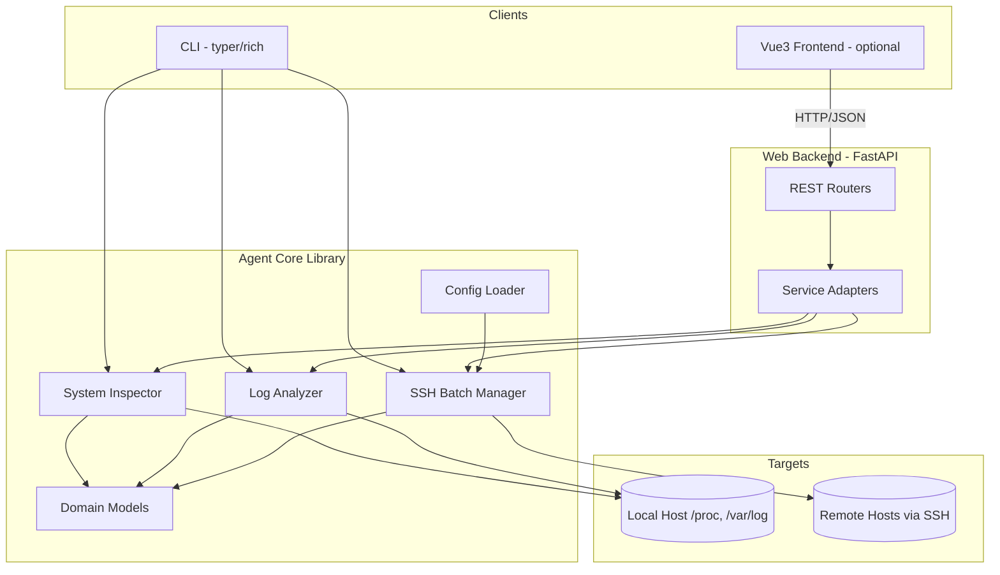
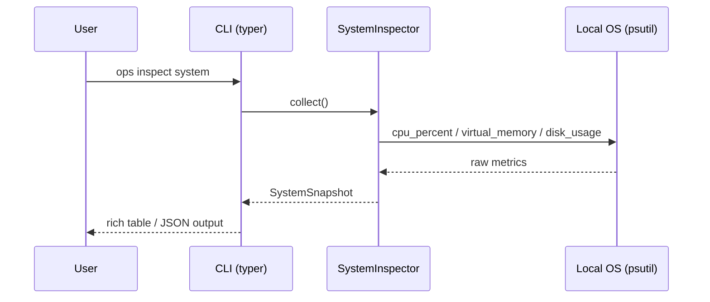
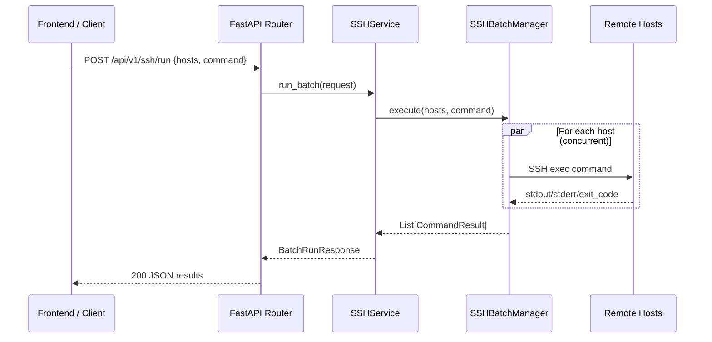
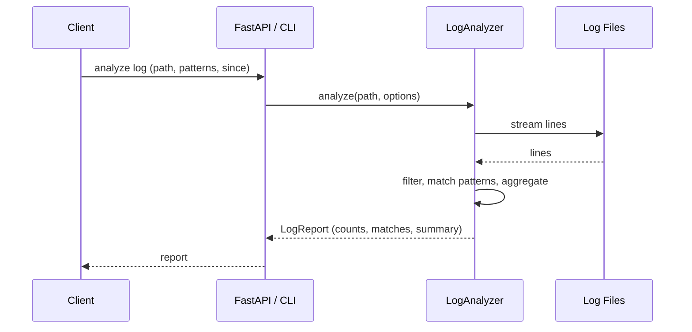

# Design Document: CLI Ops Agent

## Overview

CLI Ops Agent is a modular Python operations toolkit that inspects Linux system health (CPU, memory, disk), analyzes logs, and runs batch commands across multiple hosts over SSH. The core capabilities are exposed through three layers: a reusable **agent core library**, a **CLI** built on top of it, and a **FastAPI web backend** that exposes the same operations as a REST API for remote triggering. An optional **Vue 3 frontend** consumes the REST API to visualize inspection results.

The design deliberately keeps the agent core free of any CLI or HTTP concerns so it can be imported by both the CLI entry point and the FastAPI service without duplication. Local inspection uses `psutil`; remote batch execution uses `paramiko` (with optional `asyncssh` for concurrency); the CLI is built with `typer` + `rich`; the web layer uses `fastapi` + `uvicorn` + `pydantic`.

This document provides both a high-level view (architecture, sequence diagrams, components, data models) and a low-level view (file structure, class/function signatures, algorithmic pseudocode, and per-module dependency lists) so it can be handed directly to a coding agent for implementation.

## Architecture



**Key architectural decisions:**

- **Single source of truth (agent core):** Both the CLI and the FastAPI backend depend on the same `core` package. No business logic lives in the CLI or web layers.
- **Pydantic models everywhere:** Domain models double as FastAPI response schemas, eliminating a translation layer.
- **Pluggable execution:** Local inspection and remote SSH execution share a common `CommandResult` shape so results are uniform regardless of target.
- **Stateless web layer:** The FastAPI service holds no session state; host inventory and credentials come from config or request payloads.

## Sequence Diagrams

### Flow 1: Local system inspection via CLI



### Flow 2: Remote batch command via REST API



### Flow 3: Log analysis



## Project File Structure

```text
cli-ops-agent/
├── main.py                      # Thin launcher delegating to ops_agent.cli
├── pyproject.toml               # Project metadata + dependencies
├── requirements.txt             # Pinned dependency list
├── config/
│   └── hosts.example.yaml       # Sample host inventory
├── ops_agent/
│   ├── __init__.py
│   ├── cli/
│   │   ├── __init__.py
│   │   ├── app.py               # Typer app, command registration
│   │   ├── commands_system.py   # `inspect system` command
│   │   ├── commands_logs.py     # `analyze logs` command
│   │   └── commands_ssh.py      # `ssh run` batch command
│   ├── core/
│   │   ├── __init__.py
│   │   ├── models.py            # Pydantic domain models
│   │   ├── config.py            # Config + host inventory loader
│   │   ├── system_inspector.py  # CPU/mem/disk collection
│   │   ├── log_analyzer.py      # Log parsing + aggregation
│   │   └── ssh_manager.py       # SSH batch execution
│   ├── web/
│   │   ├── __init__.py
│   │   ├── server.py            # FastAPI app factory + uvicorn entry
│   │   ├── deps.py              # Dependency injection (services, config)
│   │   ├── schemas.py           # Request schemas (responses reuse core.models)
│   │   └── routers/
│   │       ├── __init__.py
│   │       ├── system.py        # /api/v1/system
│   │       ├── logs.py          # /api/v1/logs
│   │       └── ssh.py           # /api/v1/ssh
│   └── services/
│       ├── __init__.py
│       ├── system_service.py    # Adapts SystemInspector for web/CLI
│       ├── log_service.py       # Adapts LogAnalyzer
│       └── ssh_service.py       # Adapts SSHBatchManager
├── frontend/                    # Optional Vue3 app
│   ├── package.json
│   ├── vite.config.ts
│   └── src/
│       ├── main.ts
│       ├── App.vue
│       ├── api/client.ts        # Axios wrapper for REST API
│       ├── views/Dashboard.vue  # System metrics view
│       ├── views/Logs.vue       # Log report view
│       └── views/SshBatch.vue   # Batch command view
└── tests/
    ├── test_system_inspector.py
    ├── test_log_analyzer.py
    ├── test_ssh_manager.py
    └── test_api.py
```

## Components and Interfaces

This section summarizes the major components and their public contracts. Detailed file/class/function breakdowns and formal specifications appear in the per-module sections below.

### Component: SystemInspector (core)
**Purpose:** Collect local CPU/memory/disk metrics into a `SystemSnapshot`.
```python
class SystemInspector:
    def collect(self) -> SystemSnapshot: ...
    def collect_cpu(self) -> CpuStats: ...
    def collect_memory(self) -> MemoryStats: ...
    def collect_disks(self, mountpoints: list[str] | None = None) -> list[DiskStats]: ...
```
**Responsibilities:** read-only OS metric gathering; percent normalization.

### Component: LogAnalyzer (core)
**Purpose:** Stream and analyze a log file into a `LogReport`.
```python
class LogAnalyzer:
    def analyze(self, path: str, options: LogParseOptions) -> LogReport: ...
```
**Responsibilities:** streaming parse, time/level filtering, pattern matching, aggregation.

### Component: SSHBatchManager (core)
**Purpose:** Run a command across many hosts, returning uniform `CommandResult`s.
```python
class SSHBatchManager:
    def execute(self, hosts: list[HostConfig], command: str) -> list[CommandResult]: ...
    def execute_one(self, host: HostConfig, command: str) -> CommandResult: ...
```
**Responsibilities:** bounded-concurrency execution; per-host failure isolation.

### Component: Service Adapters
**Purpose:** Bridge core objects to CLI commands and FastAPI routers.
```python
class SystemService:
    def snapshot(self) -> SystemSnapshot: ...
class LogService:
    def analyze(self, req: LogAnalyzeRequest) -> LogReport: ...
class SSHService:
    def run_batch(self, req: BatchRunRequest, config: AppConfig) -> BatchRunResponse: ...
```
**Responsibilities:** config loading, DTO translation, host resolution.

### Component: FastAPI Routers
**Purpose:** Expose core operations over REST (see API Surface table in the Web Backend module).

## Data Models

All domain models are Pydantic `BaseModel` subclasses defined in `ops_agent/core/models.py`. They are reused directly as FastAPI response models.

```python
from datetime import datetime
from enum import Enum
from pydantic import BaseModel, Field


class CpuStats(BaseModel):
    percent: float            # overall utilization 0-100
    per_core: list[float]     # per-core utilization
    load_avg: tuple[float, float, float]  # 1/5/15 min load average
    core_count: int


class MemoryStats(BaseModel):
    total_mb: float
    used_mb: float
    available_mb: float
    percent: float            # 0-100


class DiskStats(BaseModel):
    mountpoint: str
    total_gb: float
    used_gb: float
    free_gb: float
    percent: float            # 0-100


class SystemSnapshot(BaseModel):
    hostname: str
    collected_at: datetime
    cpu: CpuStats
    memory: MemoryStats
    disks: list[DiskStats]


class LogMatch(BaseModel):
    line_number: int
    timestamp: datetime | None
    level: str | None
    pattern: str              # the pattern/keyword that matched
    content: str


class LogReport(BaseModel):
    source_path: str
    total_lines: int
    scanned_lines: int
    level_counts: dict[str, int]   # e.g. {"ERROR": 12, "WARN": 30}
    matches: list[LogMatch]
    summary: str


class CommandResult(BaseModel):
    host: str
    command: str
    exit_code: int
    stdout: str
    stderr: str
    duration_ms: int
    success: bool             # True iff exit_code == 0 and no transport error
    error: str | None = None  # connection/auth error if execution failed


class HostConfig(BaseModel):
    name: str
    hostname: str
    port: int = 22
    username: str
    password: str | None = None
    key_path: str | None = None


class AppConfig(BaseModel):
    hosts: list[HostConfig] = Field(default_factory=list)
    ssh_timeout_s: int = 15
    max_concurrency: int = 10
```

**Validation rules:**

- `percent` fields are clamped/validated to the range `[0, 100]`.
- A `HostConfig` MUST provide either `password` or `key_path` (validated by a model validator).
- `CommandResult.success` is `True` if and only if `exit_code == 0` and `error is None`.
- `max_concurrency` MUST be `>= 1`.

---

## Module: Core / System Inspector

**Description:** Collects local host metrics (CPU, memory, disk) and assembles a `SystemSnapshot`. Pure read-only access to OS metrics via `psutil`; no side effects.

**Files:**
- `ops_agent/core/system_inspector.py`: CPU/memory/disk collection logic.
- `ops_agent/core/models.py`: shared data models (also used by other modules).

**Classes:**
- `SystemInspector`: facade that aggregates individual collectors into a `SystemSnapshot`.

**Functions / Methods:**
- `SystemInspector.collect() -> SystemSnapshot`: gather a full snapshot.
- `SystemInspector.collect_cpu() -> CpuStats`: CPU utilization, per-core, load average.
- `SystemInspector.collect_memory() -> MemoryStats`: virtual memory stats.
- `SystemInspector.collect_disks(mountpoints: list[str] | None = None) -> list[DiskStats]`: per-mount usage; defaults to all physical partitions.

**Dependencies:** `psutil`, `pydantic`

### Key Functions with Formal Specifications

```python
class SystemInspector:
    def __init__(self, cpu_sample_interval: float = 0.5) -> None: ...

    def collect(self) -> SystemSnapshot: ...
    def collect_cpu(self) -> CpuStats: ...
    def collect_memory(self) -> MemoryStats: ...
    def collect_disks(self, mountpoints: list[str] | None = None) -> list[DiskStats]: ...
```

**`collect()`**
- Preconditions: process has permission to read `/proc` and mounted filesystems.
- Postconditions: returns a `SystemSnapshot` with `collected_at` set to now (UTC); `cpu`, `memory`, and at least one `DiskStats` are populated; all `percent` fields in `[0, 100]`.
- Side effects: none (read-only).

**`collect_disks(mountpoints)`**
- Preconditions: each supplied mountpoint, if any, exists.
- Postconditions: returns one `DiskStats` per readable mountpoint; unreadable mounts are skipped (logged, not raised).
- Loop invariant: each appended `DiskStats` satisfies `used_gb + free_gb <= total_gb` (within rounding).

### Algorithmic Pseudocode

```pascal
ALGORITHM collect()
OUTPUT: snapshot of type SystemSnapshot
BEGIN
  cpu    ← collect_cpu()
  memory ← collect_memory()
  disks  ← collect_disks(NULL)

  ASSERT disks.length >= 1
  RETURN SystemSnapshot(
    hostname     := getHostname(),
    collected_at := now_utc(),
    cpu          := cpu,
    memory       := memory,
    disks        := disks
  )
END

ALGORITHM collect_disks(mountpoints)
OUTPUT: results : list of DiskStats
BEGIN
  results ← empty list
  partitions ← (mountpoints IS NULL) ? psutil.partitions() : mountpoints

  FOR each p IN partitions DO
    ASSERT all results so far are valid
    TRY
      usage ← psutil.disk_usage(p)
      results.add(DiskStats(p, usage.total, usage.used, usage.free, usage.percent))
    CATCH PermissionError OR OSError
      log_warning("skipping " + p)
    END TRY
  END FOR

  RETURN results
END
```

---

## Module: Core / Log Analyzer

**Description:** Streams a log file line by line, filters by time window and log level, matches user-supplied keywords/regex patterns, and aggregates counts into a `LogReport`. Streaming avoids loading large files fully into memory.

**Files:**
- `ops_agent/core/log_analyzer.py`: parsing, filtering, aggregation.

**Classes:**
- `LogAnalyzer`: orchestrates streaming analysis.
- `LogParseOptions`: dataclass/model bundling patterns, level filter, `since` window, and max matches.

**Functions / Methods:**
- `LogAnalyzer.analyze(path: str, options: LogParseOptions) -> LogReport`: main entry point.
- `LogAnalyzer._parse_line(line: str, line_no: int) -> ParsedLine`: extract timestamp/level/content.
- `LogAnalyzer._matches(parsed: ParsedLine, options: LogParseOptions) -> list[str]`: returns patterns that matched.

**Dependencies:** `pydantic`, standard library `re`, `datetime` (optionally `python-dateutil` for flexible timestamp parsing)

### Key Functions with Formal Specifications

```python
class LogParseOptions(BaseModel):
    patterns: list[str] = []          # regex or plain keywords
    levels: list[str] | None = None   # e.g. ["ERROR", "WARN"]
    since: datetime | None = None     # only lines at/after this time
    max_matches: int = 1000

class LogAnalyzer:
    def analyze(self, path: str, options: LogParseOptions) -> LogReport: ...
```

**`analyze(path, options)`**
- Preconditions: `path` exists and is readable; each pattern is a valid regex; `max_matches >= 0`.
- Postconditions: `report.scanned_lines <= report.total_lines`; `len(report.matches) <= options.max_matches`; `sum(level_counts.values())` equals number of lines whose level was identified within the scanned window.
- Side effects: none beyond file reads.

### Algorithmic Pseudocode

```pascal
ALGORITHM analyze(path, options)
OUTPUT: report of type LogReport
BEGIN
  ASSERT file_exists(path)

  total       ← 0
  scanned     ← 0
  level_counts ← empty map
  matches     ← empty list

  FOR each (line, line_no) IN stream_lines(path) DO
    total ← total + 1
    parsed ← _parse_line(line, line_no)

    // time window filter
    IF options.since ≠ NULL AND parsed.timestamp ≠ NULL
       AND parsed.timestamp < options.since THEN
      CONTINUE
    END IF

    // level filter
    IF options.levels ≠ NULL AND parsed.level ∉ options.levels THEN
      CONTINUE
    END IF

    scanned ← scanned + 1
    IF parsed.level ≠ NULL THEN
      level_counts[parsed.level] ← level_counts[parsed.level] + 1
    END IF

    INVARIANT: matches.length <= options.max_matches
    IF matches.length < options.max_matches THEN
      FOR each pat IN _matches(parsed, options) DO
        matches.add(LogMatch(line_no, parsed.timestamp, parsed.level, pat, line))
      END FOR
    END IF
  END FOR

  RETURN LogReport(path, total, scanned, level_counts, matches,
                   summary := build_summary(level_counts, matches))
END
```

---

## Module: Core / SSH Batch Manager

**Description:** Executes a command across many hosts concurrently over SSH, returning a uniform `CommandResult` per host. Isolates per-host failures so one unreachable host does not abort the batch. Concurrency is bounded by `max_concurrency`.

**Files:**
- `ops_agent/core/ssh_manager.py`: connection handling and concurrent execution.
- `ops_agent/core/config.py`: loads host inventory + SSH defaults.

**Classes:**
- `SSHBatchManager`: runs commands across a host list with bounded concurrency.
- `SSHConnection`: thin wrapper around a single host session (connect, exec, close).

**Functions / Methods:**
- `SSHBatchManager.execute(hosts: list[HostConfig], command: str) -> list[CommandResult]`: run on all hosts.
- `SSHBatchManager.execute_one(host: HostConfig, command: str) -> CommandResult`: run on a single host with timeout + error capture.
- `SSHConnection.open() / run(command) / close()`: lifecycle for one session.

**Dependencies:** `paramiko` (synchronous SSH); optional `asyncssh` for async concurrency; `pydantic`; standard library `concurrent.futures` (if using thread-pool concurrency with paramiko)

### Key Functions with Formal Specifications

```python
class SSHBatchManager:
    def __init__(self, timeout_s: int = 15, max_concurrency: int = 10) -> None: ...

    def execute(self, hosts: list[HostConfig], command: str) -> list[CommandResult]: ...
    def execute_one(self, host: HostConfig, command: str) -> CommandResult: ...
```

**`execute(hosts, command)`**
- Preconditions: `command` is non-empty; `max_concurrency >= 1`; each host has valid auth (password or key).
- Postconditions: returns exactly one `CommandResult` per input host; results preserve input order; a connection/auth failure yields a `CommandResult` with `success=False` and a populated `error` (never raises for individual host failures).
- Side effects: opens/closes network connections; runs the command remotely (the command itself may have side effects on the target).

**`execute_one(host, command)`**
- Preconditions: `host` is well-formed.
- Postconditions: `success == (exit_code == 0 and error is None)`; `duration_ms >= 0`; on timeout, `error` describes the timeout and `success=False`.

### Algorithmic Pseudocode

```pascal
ALGORITHM execute(hosts, command)
OUTPUT: results : list of CommandResult (same order as hosts)
BEGIN
  ASSERT command ≠ "" AND max_concurrency >= 1

  pool    ← thread_pool(size := min(max_concurrency, hosts.length))
  futures ← map host → pool.submit(execute_one, host, command)

  results ← empty list sized hosts.length
  FOR each (index, host) IN enumerate(hosts) DO
    INVARIANT: results[0..index-1] are populated
    results[index] ← futures[host].result()   // never raises; errors captured inside
  END FOR

  pool.shutdown()
  RETURN results
END

ALGORITHM execute_one(host, command)
OUTPUT: result of type CommandResult
BEGIN
  start ← now_ms()
  TRY
    conn ← SSHConnection(host).open(timeout := timeout_s)
    (stdout, stderr, code) ← conn.run(command, timeout := timeout_s)
    conn.close()
    RETURN CommandResult(host.name, command, code, stdout, stderr,
                         duration_ms := now_ms() - start,
                         success := (code = 0))
  CATCH AuthError OR ConnectError OR TimeoutError AS e
    RETURN CommandResult(host.name, command, exit_code := -1,
                         stdout := "", stderr := "",
                         duration_ms := now_ms() - start,
                         success := false, error := str(e))
  END TRY
END
```

---

## Module: CLI

**Description:** Command-line interface built with Typer. Provides subcommands for system inspection, log analysis, and SSH batch execution. Renders results as rich tables or JSON (`--json` flag). Contains no business logic; delegates to `core`/`services`.

**Files:**
- `ops_agent/cli/app.py`: Typer application, global options (`--json`, `--config`).
- `ops_agent/cli/commands_system.py`: `inspect system`.
- `ops_agent/cli/commands_logs.py`: `analyze logs`.
- `ops_agent/cli/commands_ssh.py`: `ssh run`.
- `main.py`: launcher calling `ops_agent.cli.app:run`.

**Classes:** none required (Typer uses functions as commands).

**Functions:**
- `run() -> None`: Typer app entry point.
- `inspect_system(json_out: bool) -> None`: prints a `SystemSnapshot`.
- `analyze_logs(path: str, pattern: list[str], level: list[str], since: str | None, json_out: bool) -> None`.
- `ssh_run(command: str, host: list[str] | None, config: str | None, json_out: bool) -> None`.
- `render_snapshot(snapshot, json_out)` / `render_report(report, json_out)` / `render_results(results, json_out)`: output helpers.

**Dependencies:** `typer`, `rich`, plus the `core` package

### Example Usage

```bash
# Inspect local system, pretty table
ops inspect system

# Same, as JSON for piping
ops inspect system --json

# Analyze a log for errors since a time
ops analyze logs /var/log/syslog --pattern "ERROR" --level ERROR --since "2024-01-01T00:00:00"

# Run a command across hosts from inventory file
ops ssh run "df -h" --config config/hosts.yaml

# Run against ad-hoc hosts
ops ssh run "uptime" --host web1 --host web2 --json
```

```python
# main.py
from ops_agent.cli.app import run

if __name__ == "__main__":
    run()
```

---

## Module: Web Backend (FastAPI)

**Description:** Exposes the agent core over REST so the operations can be triggered remotely (by the Vue frontend or any HTTP client). Stateless; reuses `core.models` as response schemas. Each router delegates to a service adapter.

**Files:**
- `ops_agent/web/server.py`: `create_app()` factory, CORS, router registration, uvicorn entry.
- `ops_agent/web/deps.py`: dependency-injection providers for config and services.
- `ops_agent/web/schemas.py`: request bodies (e.g. `BatchRunRequest`, `LogAnalyzeRequest`).
- `ops_agent/web/routers/system.py`: `GET /api/v1/system`.
- `ops_agent/web/routers/logs.py`: `POST /api/v1/logs/analyze`.
- `ops_agent/web/routers/ssh.py`: `POST /api/v1/ssh/run`.

**Classes (Pydantic request schemas):**
- `LogAnalyzeRequest`: `{ path, patterns, levels, since, max_matches }`.
- `BatchRunRequest`: `{ command, hosts: list[HostConfig] | host_names: list[str] }`.
- `BatchRunResponse`: `{ results: list[CommandResult] }`.

**Functions / Endpoints:**
- `create_app() -> FastAPI`: builds and configures the app.
- `get_system()` → `SystemSnapshot` (GET `/api/v1/system`).
- `analyze_logs(req: LogAnalyzeRequest)` → `LogReport` (POST `/api/v1/logs/analyze`).
- `run_batch(req: BatchRunRequest)` → `BatchRunResponse` (POST `/api/v1/ssh/run`).
- `health()` → `{ "status": "ok" }` (GET `/healthz`).

**Dependencies:** `fastapi`, `uvicorn[standard]`, `pydantic`, plus the `core`/`services` packages

### API Surface

| Method | Path                    | Request            | Response          |
|--------|-------------------------|--------------------|-------------------|
| GET    | `/healthz`              | –                  | `{status}`        |
| GET    | `/api/v1/system`        | –                  | `SystemSnapshot`  |
| POST   | `/api/v1/logs/analyze`  | `LogAnalyzeRequest`| `LogReport`       |
| POST   | `/api/v1/ssh/run`       | `BatchRunRequest`  | `BatchRunResponse`|

### Example Usage

```python
# ops_agent/web/server.py
from fastapi import FastAPI
from fastapi.middleware.cors import CORSMiddleware
from ops_agent.web.routers import system, logs, ssh


def create_app() -> FastAPI:
    app = FastAPI(title="CLI Ops Agent API", version="1.0.0")
    app.add_middleware(
        CORSMiddleware,
        allow_origins=["*"],          # tighten in production
        allow_methods=["*"],
        allow_headers=["*"],
    )
    app.include_router(system.router, prefix="/api/v1")
    app.include_router(logs.router, prefix="/api/v1")
    app.include_router(ssh.router, prefix="/api/v1")

    @app.get("/healthz")
    def health() -> dict[str, str]:
        return {"status": "ok"}

    return app


app = create_app()

# Run: uvicorn ops_agent.web.server:app --host 0.0.0.0 --port 8000
```

> **Security note:** The SSH endpoint executes arbitrary commands on remote hosts and the API is created without authentication. Before any non-local deployment, add authentication (API key / OAuth) and restrict CORS origins; never expose `/api/v1/ssh/run` publicly. Credentials should come from server-side config (`config/hosts.yaml`) rather than request bodies where possible, and the inventory file should be permission-restricted.

---

## Module: Services (Adapters)

**Description:** Thin layer that adapts the core library for use by both the CLI and the web backend: loads config, instantiates core objects, and translates request DTOs into core calls. Keeps routers and CLI commands trivial.

**Files:**
- `ops_agent/services/system_service.py`
- `ops_agent/services/log_service.py`
- `ops_agent/services/ssh_service.py`

**Classes:**
- `SystemService`: `snapshot() -> SystemSnapshot`.
- `LogService`: `analyze(req: LogAnalyzeRequest) -> LogReport`.
- `SSHService`: `run_batch(req: BatchRunRequest, config: AppConfig) -> BatchRunResponse`, resolving `host_names` against the inventory.

**Functions:**
- `SSHService._resolve_hosts(req, config) -> list[HostConfig]`: merge inline hosts with names looked up in config.

**Dependencies:** `pydantic`, plus the `core` package

---

## Module: Config

**Description:** Loads application configuration and host inventory from a YAML file (and/or environment variables), validating into `AppConfig`/`HostConfig`. Supports referencing key files for SSH auth.

**Files:**
- `ops_agent/core/config.py`
- `config/hosts.example.yaml`

**Classes:** uses `AppConfig` / `HostConfig` from `models.py`.

**Functions:**
- `load_config(path: str | None = None) -> AppConfig`: read YAML, apply env overrides, validate.
- `find_host(config: AppConfig, name: str) -> HostConfig`: lookup by name (raises if missing).

**Dependencies:** `pydantic`, `pyyaml`

### Example `config/hosts.example.yaml`

```yaml
ssh_timeout_s: 15
max_concurrency: 10
hosts:
  - name: web1
    hostname: 10.0.0.11
    username: ops
    key_path: ~/.ssh/id_rsa
  - name: web2
    hostname: 10.0.0.12
    username: ops
    password: ${WEB2_PASSWORD}   # env-substituted at load time
```

---

## Module: Frontend (Optional, Vue 3)

**Description:** Single-page Vue 3 + Vite app that visualizes inspection results and batch outputs by calling the REST API. Optional; the system is fully functional via CLI/API without it.

**Files:**
- `frontend/src/main.ts`: app bootstrap.
- `frontend/src/App.vue`: layout + navigation.
- `frontend/src/api/client.ts`: Axios client wrapping the REST endpoints.
- `frontend/src/views/Dashboard.vue`: CPU/memory/disk gauges from `GET /api/v1/system`.
- `frontend/src/views/Logs.vue`: form + table for `POST /api/v1/logs/analyze`.
- `frontend/src/views/SshBatch.vue`: command form + per-host result table for `POST /api/v1/ssh/run`.

**Components/Functions:**
- `useSystem()`, `useLogs()`, `useSsh()`: composables wrapping API calls + loading/error state.
- `client.getSystem() / analyzeLogs(req) / runBatch(req)`: typed API functions.

**Dependencies (npm):** `vue@3`, `vite`, `axios`, `vue-router`, optionally `element-plus` or `naive-ui` for UI components and `echarts` for gauges.

---

## Correctness Properties

For all valid inputs, the following must hold (suitable for property-based tests with `hypothesis`):

### Property 1: Percent bounds
For any `SystemSnapshot s`, every `percent` field across `cpu`, `memory`, and `disks` satisfies `0 <= percent <= 100`.

### Property 2: Disk consistency
For any `DiskStats d`, `d.used_gb + d.free_gb <= d.total_gb` within a small rounding epsilon, and `d.total_gb >= 0`.

### Property 3: Batch completeness and order
For any host list `H` and command `c`, `execute(H, c)` returns a list of length `len(H)` whose i-th result corresponds to `H[i]`.

### Property 4: Failure isolation
For any host list containing unreachable hosts, `execute` never raises; each unreachable host yields a `CommandResult` with `success == False` and non-null `error`.

### Property 5: Success definition
For any `CommandResult r`, `r.success == (r.exit_code == 0 and r.error is None)`.

### Property 6: Log match cap
For any `path` and `options`, `analyze(path, options)` returns `len(matches) <= options.max_matches` and `scanned_lines <= total_lines`.

### Property 7: Level count integrity
For any analyzed log, `sum(level_counts.values())` equals the number of scanned lines whose level was identified.

### Property 8: Config auth invariant
Any `HostConfig` that validates successfully has at least one of `password` or `key_path` set.

## Error Handling

| Scenario | Condition | Response | Recovery |
|----------|-----------|----------|----------|
| Permission denied reading disk/log | OS denies access | Skip mount (inspector) / return 403-style error (API for logs) | Log warning; continue with available data |
| Missing log file | `path` does not exist | API returns `404`; CLI prints error and exits non-zero | User corrects path |
| SSH auth failure | Bad credentials/key | `CommandResult.success=False`, `error` set | Other hosts unaffected; user fixes inventory |
| SSH timeout | Host unreachable within `timeout_s` | `CommandResult` with timeout error | Batch completes for reachable hosts |
| Invalid regex pattern | Bad pattern in `LogAnalyzeRequest` | API returns `422`; CLI prints validation error | User corrects pattern |
| Invalid config | YAML malformed / auth missing | Raise `ConfigError` at startup with clear message | User fixes config file |

## Testing Strategy

### Unit Testing
- `SystemInspector`: mock `psutil` to assert model construction and percent clamping.
- `LogAnalyzer`: feed in-memory line streams; assert filtering, level counts, and match cap.
- `SSHBatchManager`: mock `SSHConnection` to simulate success, auth failure, and timeout; assert order and failure isolation.
- `services` + `routers`: use FastAPI `TestClient` to assert status codes and response schemas.

### Property-Based Testing
- **Library:** `hypothesis`.
- Generate random metric values to verify percent-bounds and disk-consistency properties.
- Generate random host lists (mix of reachable/unreachable mocks) to verify batch completeness, order, and failure isolation.
- Generate random log streams + options to verify match-cap and level-count integrity properties.

### Integration Testing
- Spin up the FastAPI app with `TestClient`; exercise each endpoint end-to-end against mocked core collaborators.
- Optional: a local SSH container fixture (e.g. `linuxserver/openssh-server`) for a real end-to-end `ssh run` test.

## Performance Considerations

- **SSH concurrency:** bounded by `max_concurrency` to avoid exhausting file descriptors / target load; tune per environment. Consider `asyncssh` for very large fleets.
- **Log streaming:** lines are processed in a streaming fashion (generator), keeping memory flat regardless of file size; `max_matches` caps result payload size.
- **CPU sampling:** `collect_cpu` uses a short sampling interval (default 0.5s); expose as a parameter so callers can trade accuracy for latency.

## Security Considerations

- The `/api/v1/ssh/run` endpoint runs arbitrary remote commands — it MUST be protected by authentication and network restrictions before any shared/production use.
- Credentials and key paths should be stored in a permission-restricted config file; prefer key-based auth over passwords; support env-var substitution to avoid plaintext secrets in files.
- CORS is permissive by default for development; restrict `allow_origins` in production.
- Validate and, where feasible, constrain commands (allowlist) for the SSH endpoint to reduce blast radius.

## Dependencies

**Python (backend + CLI):**
- `psutil` — local system metrics
- `paramiko` — SSH execution (optional `asyncssh` for async concurrency)
- `typer` — CLI framework
- `rich` — CLI rendering
- `fastapi` — web framework
- `uvicorn[standard]` — ASGI server
- `pydantic` (v2) — data models / validation
- `pyyaml` — config loading
- Dev/test: `pytest`, `hypothesis`, `httpx` (for `TestClient`)

**Frontend (optional, npm):**
- `vue@3`, `vite`, `vue-router`, `axios`
- optional UI: `element-plus` or `naive-ui`; charts: `echarts`
